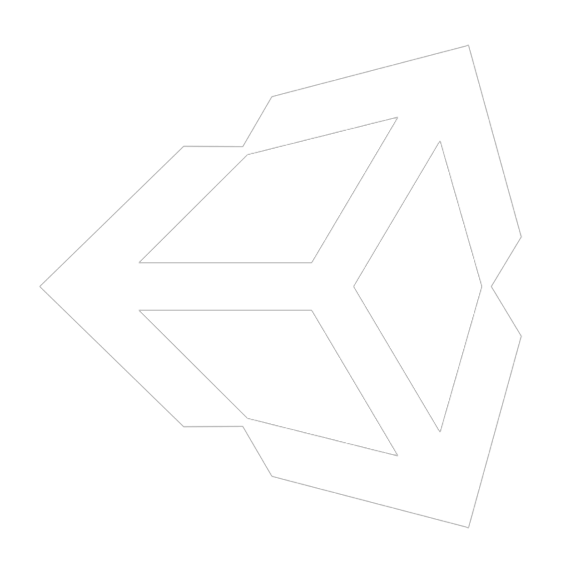

<h1 align="left">Imad Fenniche</h1>

###

<h4 align="left">I am a full-Stack Developer.</h4>

###

I do other stuff like: 🖥️ desktop app development. 🎥 video editing. 📷 photography 🖼️ design and photo editing

###

<h2 align="left">🌟 # Skills</h2>

###

  
  
  
  
  
  
  
  
  
  
  
  
  
  
  
  
  
  
  
  
  
  

###

<h3 align="left">Currently learning:</h3>

###

💠 Cyber security. 💠 Non-SQL database. 💠 AI and machine learning. 💠 Mobile App development. 💠 Game Development.

###

<h2 align="left">📊 # Stats</h2>

###

  
  

###

<h2 align="left">🔗 # Links</h2>

###

###

   
  
  
  
  
  

###

 
<h3 align="left">🔥 # Cool Stuff</h3>

###

###
